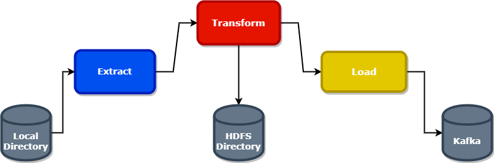

<!-- TOC -->
## Table of Contents
  * [Description](#description)
  * [Architecture](#architecture)
  * [Configuration](#configuration)
  * [Requirements](#requirements)
<!-- TOC -->

## Description

An ETL process for Bayesian Network using Apache Airflow,Apache Kafka and HDFS.

The integration of the Apache Airflow boils down to the fact that we want to exploit
the functionality of provided scheduler in order to offer the following steps in a schedule way:

    1. Load the dataset from the inputPath local directory
    2. Make some transforms(cleansing,add partition_id column) on dataset 
    3. Write some stats of dataset to the HDFS directory
    4. Load the dataset from the HDFS directory and write to Apache Kafka

## Architecture


## Configuration

The configuration of dag run can be passed either using the argument **--config** or through **UI**

    Hadoop => host,port
    Kafka => topic,servers,numPartitions
    Local => inputPath

```json
"inputPath": "path_to_local_dir",
"host": "host_url",
"port": "port_number",
"topic": "topic_name",
"servers": "bootstrap_servers",
"numPartitions": "partitions"
```

## Requirements
* [Requirements](requirements/requirements.txt)
